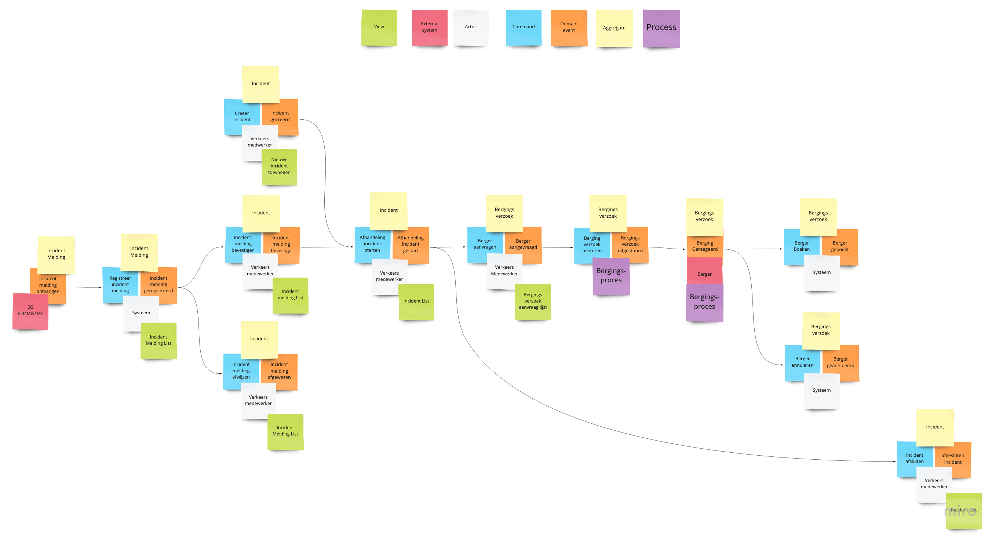
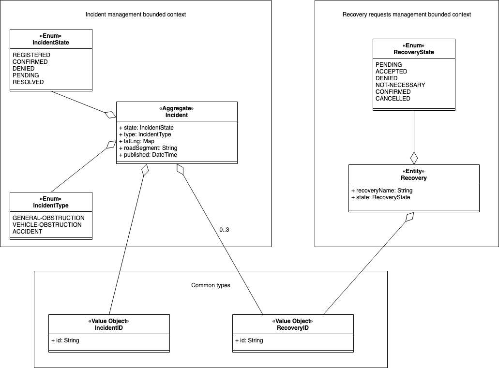
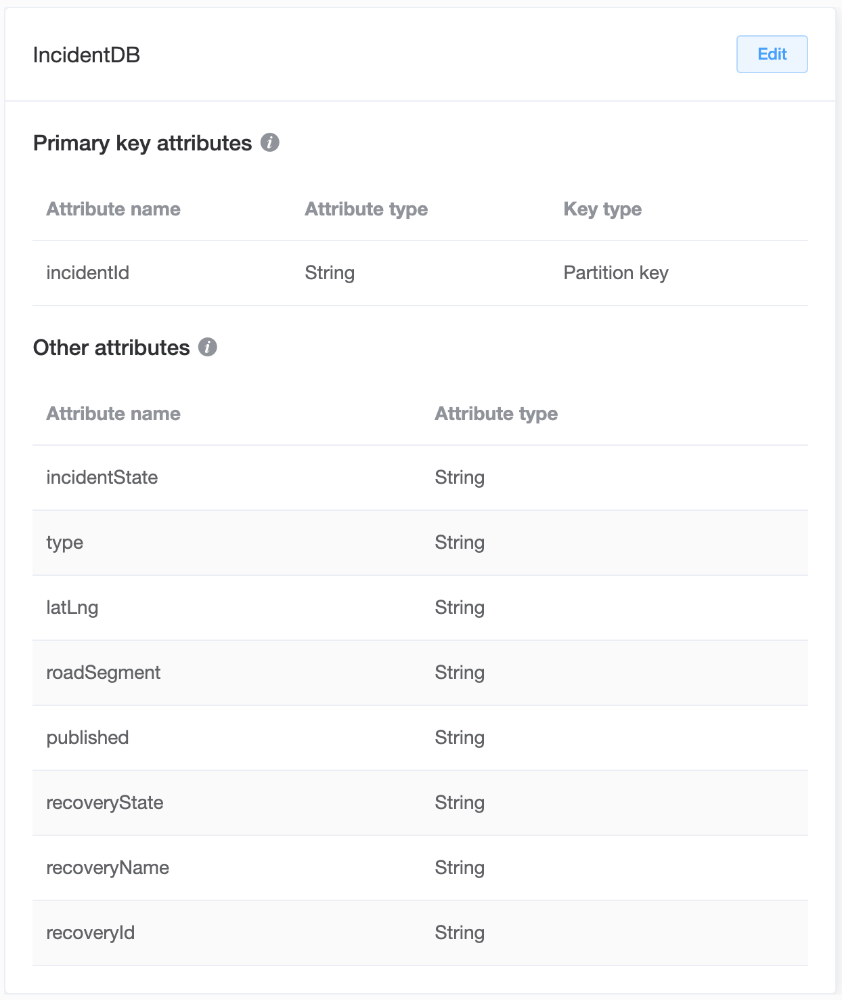
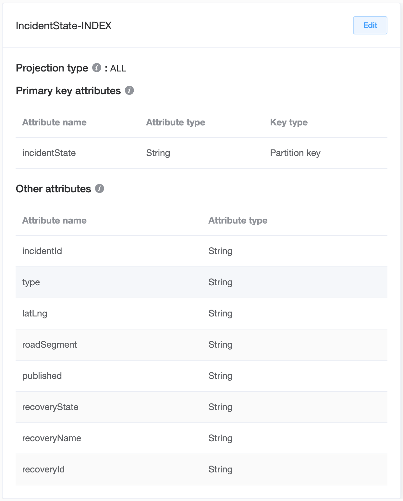
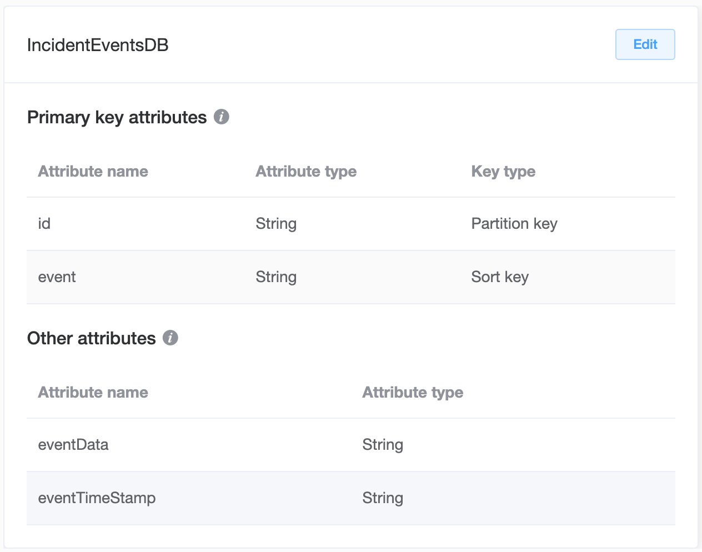
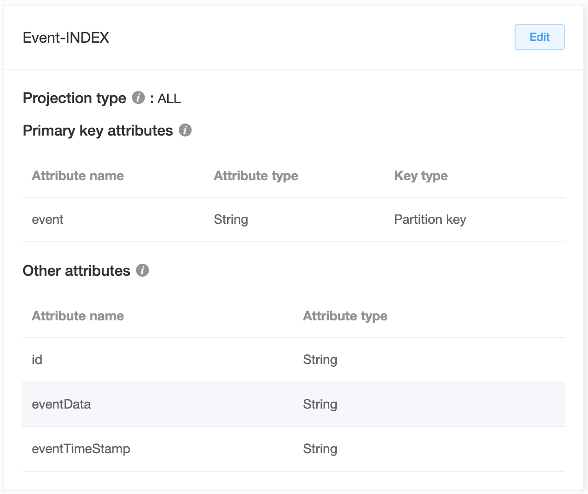
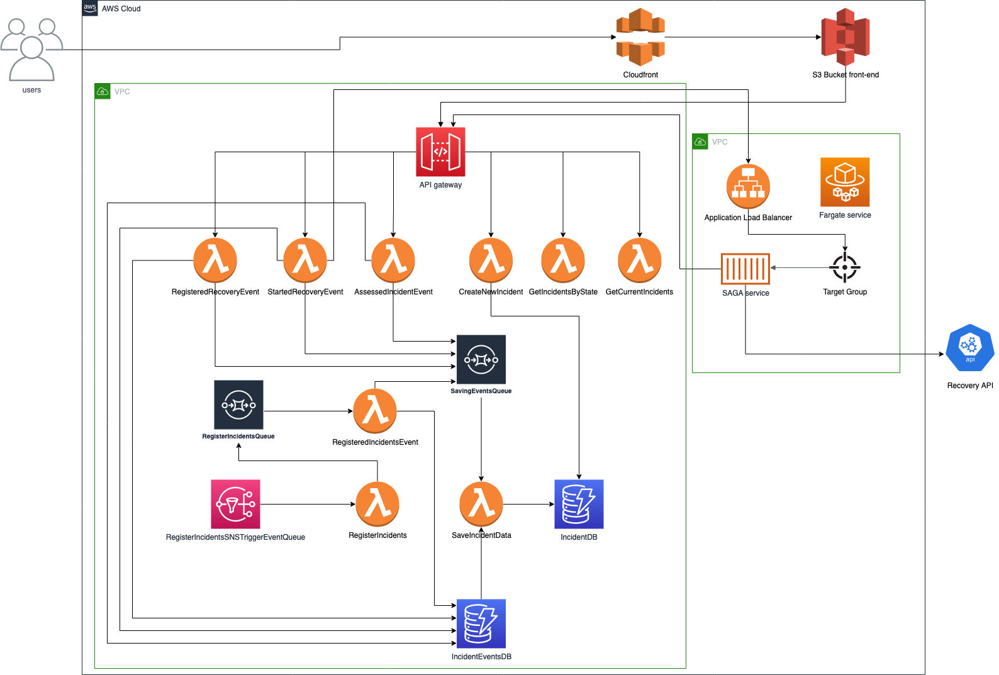

# READ ME
Geschreven en ontwikkeld door Lucas Scheepers

## 1. Stappenplan om de applicatie te starten
##### Stap 1
- Enable de cloudfront distribution dk8lbsomzkt83.cloudfront.net
	
##### Stap 2
- In de ECS cluster 'SAGA' staat één service genaamd: 'saga-container-service'
	- Update de desired count (number of tasks) van deze service naar 1 
		- Laat de 'health check grace period' op 100 staan
- Check of de services zijn opgestart d.m.v. een health check: http://EC2Co-EcsEl-174JR7MRZ6YNG-1811941670.us-east-1.elb.amazonaws.com/actuator/health

##### Stap 3
- Ga naar SQS --> purge alle messages van de queue genaamd: BACKEND-SAM-RegisterIncidentsSNSTriggerEventQueue-C41MVB2L4XM0
- Enable de SNS queue van de BACKEND-SAM-RegisterIncidents-19NTISF5GW7BK lambda

##### Stap 4
Nadat alles volledig is opgestart is de web applicatie hier te bereiken: dk8lbsomzkt83.cloudfront.net

##### Stap 5
- Update de desired count (number of tasks) van de service in de cluster naar 0 & disable de SNS queue van de BACKEND-SAM-RegisterIncidents-19NTISF5GW7BK lambda & disable de cloudfront distribution dk8lbsomzkt83.cloudfront.net

## 2. AWS resources
##### Gebruikte AWS resources
- S3 bucket voor front-end genaamd: eindopdracht-blok2-front-end
- S3 bucket voor codepipeline genaamd: eindopdracht-blok2-sam
- CloudFront distribution met ID: EJQWUNWPYSIM0
- CodePipelines genaamd:
	- EINDOPDRACHT-BLOK2-FUNCTIONAL-TESTS
	- EINDOPDRACHT-BLOK2-FRONTEND-PIPELINE
	- EINDOPDRACHT-BLOK2-SAM-BACKEND-PIPELINE
	- EINDOPDRACHT-BLOK2-SAGA-BACKEND-PIPELINE
- Load balancer genaamd: EC2Co-EcsEl-174JR7MRZ6YNG
	- Target group genaamd:
		- EC2Co-Defau-156R7C3RWDF7W
- ECS cluster genaamd: SAGA 
	- ECR repo's genaamd:
		- blok2-eindopdracht-saga
- CodeCommit repositories genaamd:
	- EINDOPDRACHT-BLOK2-SAM-BACKEND
	- EINDOPDRACHT-BLOK2-FUNCTIONAL-TESTS
	- EINDOPDRACHT-BLOK2-FRONTEND
	- EINDOPDRACHT-BLOK2-SAGA-BACKEND
- VPC genaamd: vpc-033582ba1db18a26a & vpc-2adf1c57 
- Security groups genaamd:
	-  sg-007c73e48528e6cd8
	-  sg-0282fe557eb4dd127
	-  sg-0752e20d86af717b5
	-  sg-e043d5d1
- IAM roles genaamd:
	- codebuild-EINDOPDRACHT-BLOK2-TESTS-CODEBUILD-service-role
	- codebuild-EINDOPDRACHT-BLOK2-SAM-BACKEND-CODEBUILD-service-role
	- codebuild-EINDOPDRACHT-BLOK2-FRONT-END-CODEBUILD-service-role
	- codebuild-BLOK2-EINDOPDRACHT-SAGA-CODEBUILD-service-role
	- BACKEND-SAM-RegisteredRecoveryEventRole-L3J7KHKZM1R5
	- BACKEND-SAM-StartedRecoveryEventRole-ZE8GPEJOEEFK
	- BACKEND-SAM-AssessedIncidentEventRole-GB5CCI4PWWIA
	- BACKEND-SAM-CreateNewIncidentRole-AZ3LOHPCU7MC
	- BACKEND-SAM-RegisterIncidentsRole-1EJT18IS96K0E
	- BACKEND-SAM-GetIncidentsByStateRole-1CS4IC15PYLGW
	- BACKEND-SAM-SaveIncidentDataRole-60C782HDIK9M
	- BACKEND-SAM-RegisteredIncidentsEventRole-1CPV4YE4E7SX 
- API gateway genaamd: AIMAS API
- DynamoDB tabellen genaamd: IncidentDB & IncidentsEventDB
- SNS queue genaamd: BACKEND-SAM-RegisterIncidentsSNSTriggerEventQueue-C41MVB2L4XM0
- SQS queue genaamd: RegisterIncidentsQueue & SavingEventsQueue

	
## 3. CodeCommit
- https://console.aws.amazon.com/codesuite/codecommit/repositories/EINDOPDRACHT-BLOK2-SAM-BACKEND/browse?region=us-east-1
- https://console.aws.amazon.com/codesuite/codecommit/repositories/EINDOPDRACHT-BLOK2-FUNCTIONAL-TESTS/browse?region=us-east-1
- https://console.aws.amazon.com/codesuite/codecommit/repositories/EINDOPDRACHT-BLOK2-FRONTEND/browse?region=us-east-1
- https://console.aws.amazon.com/codesuite/codecommit/repositories/EINDOPDRACHT-BLOK2-SAGA-BACKEND/browse?region=us-east-1
    

## 3. Diagrammen

### Event Storming
Aangezien er geen tijd meer over was om de feedback van het EventStorming diagram te vewerken, heb ik twee domeinen geïmplementeerd (Incident & Recovery). Incident melding heb ik dus eruit gelaten.

### Domein model

### Database model + GSI (Incident)

### Database model + GSI (IncidentEvents)

Deze global secondary index was bedoeld om de logs op te halen en te weergeven in de front-end. Vanwege tijdgebrek is dit niet meer geïmplementeerd in de front-end

### Architectuur ontwerp

